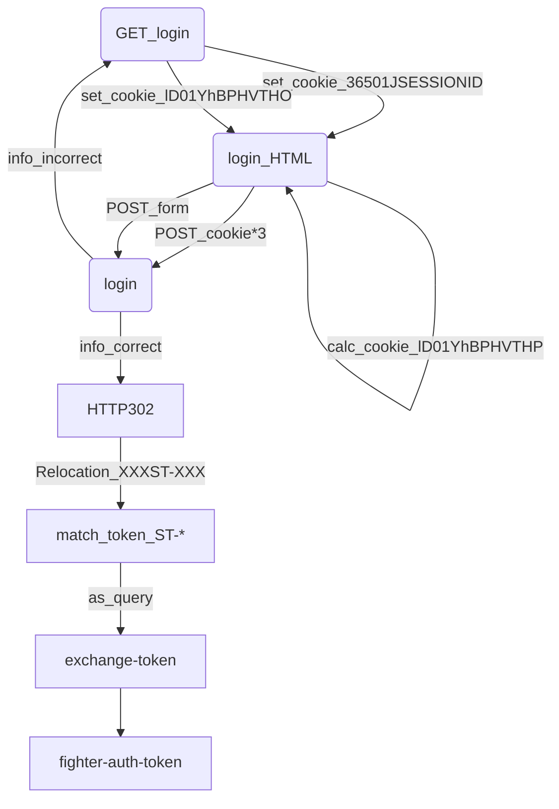

### 统一登录系统是如何工作的

- 用户访问`http://counselor.swu.edu.cn/#/index`, 网站发现没有用户登录信息, 跳转统一登录界面

- 跳转至登录页面, 链接为

  ```text
  https://uaaap.swu.edu.cn/cas/login?
  service=http://counselor.swu.edu.cn/gateway/fighter-integrate-uaap/integrate/uaap/cas/resolve-cas-return?next=http://counselor.swu.edu.cn/#/casLogin?toUrl=%2Findex
  ```

  显而易见, query是登录成功的跳转链接
  
- 获取登录页面HTML文件时响应头有两个`Set-Cookie`

  ```text
  Set-Cookie: 36501JSESSIONID=XXXXXXXXXXXXXXXXXXXXXXXXXXXXXXXX-n1; Path=/cas/; Secure; HttpOnly
  Set-Cookie: 
  XXXXXXXXXXXXXXXXXXXXXXXXXXXXXXXXXXXXXXXXXXXXXXXXXXXXXXXXXXXXXXXXXXXXXXXXXXXXXXXXXXXXXXXXXXXXXXXXXXXXX; Path=/; expires=Wed, XX XXX XXXX XX:XX:XX GMT; Secure; HttpOnly
  ```

  其中`lD01YhBPHVTHO`为明文Cookie, `AiHJXIs5GyJH.dee59c7.js`会将其加密为混淆Cookie`lD01YhBPHVTHP`
  
  **其加密采用了瑞数不知道哪一代的cookie混淆, 单独开一个文档说**[数瑞COOKIE混淆是如何工作的](./数瑞COOKIE混淆是如何工作的.md)
  
- 用户登录时, 发送如下请求

  ```http
  GET http://counselor.swu.edu.cn/gateway/fighter-integrate-uaap/integrate/uaap/cas/resolve-cas-return?next=http://counselor.swu.edu.cn/#/casLogin?toUrl=/index
  
  username: 222222222222222
  password: 222222
  lt: LT-222222-XXXXXXXXXXXXXXXXXXXXXXXXXXXXXX-http://XXX.XXX.XXX.XXX:XXXX/cas
  execution: eXsX
  _eventId: submit
  isQrSubmit: false
  qrValue: 
  ```

  可以在HTML的`<form>`中找到这几个字段对应值
  
  ```html
  <input type="hidden" name="lt" value="LT-222222-XXXXXXXXXXXXXXXXXXXXXXXXXXXXXX-http://XXX.XXX.XXX.XXX:XXXX/cas">
  <input type="hidden" name="execution" value="eXsX">
  <input type="hidden" name="_eventId" value="submit">
  <input type="hidden" name="isQrSubmit" value="false" id="isQrSubmit">
  <input type="hidden" name="qrValue" value="" id="qrValue">
  ```
  
  且携带cookie
  
  ```
  36501JSESSIONID=XXXXXXXXXXXXXXXXXXXXXXXXXXXXXXXX-n1;
  lD01YhBPHVTHO=XXXXXXXXXXXXXXXXXXXXXXXXXXXXXXXXXXXXXXXXXXXXXXXXXXXXXXXXXXXXXXXXXXXXXXXXXXXXXXXXXXXXXXX; lD01YhBPHVTHP=XXXXXXXXXXXXXXXXXXXXXXXXXXXXXXXXXXXXXXXXXXXXXXXXXXXXXXXXXXXXXXXXXXXXXXXXXXXXXXXXXXXXXXXXXXXXXXXXXXXXXXXXXXXXXXXXXXXXXXXXXXXXXXXXXXXXXXXXXXXXXXXXXXXXXXXXXXXXXXXXXXXXXXXXXXXXXXXXXXXXXXXXXXXXXXXXXXXXXXXXXXXXXXXXXXXXXXXXXXXXXXXXXXXXXXXXXXXXXXXXXXXXXXXXXXXXXXXXXXXXXXXXXXXXXXXXXXXXXXXXXXXXXXXXXXXXXXXXXXXXXXXXXXXXXXXXXXXXXXXXXXXXXXXXXXXXXXXXXXXXXXX
  ```
  
  请求成功时获得HTTP302, 可以在Relocation中找到
  
  ```
  ST-XXXXXX-XXXXXXXXXXXXXXXXXXXX-http://XXX.XXX.XXX.XXX:XXXX/cas
  ```
  
- 一般子网站还需要将统一登陆系统的`token`转换为本站的`token`, 以智慧X大为例

  ```
  POST  http://counselor.swu.edu.cn/gateway/fighter-integrate-uaap/integrate/uaap/cas/resolve-cas-return?next=http%3A%2F%2Fcounselor.swu.edu.cn%2F%23%2FcasLogin%3FtoUrl%3D%252Findex&ticket=ST-XXXXXX-XXXXXXXXXXXXXXXXXXXX-http://XXX.XXX.XXX.XXX:XXXX/cas
  ```
  
  获得`token`, 即临时授权码
  
  ```
  XXXXXXXX-XXXX-XXXX-XXXX-XXXXXXXXXXXX
  ```

即



