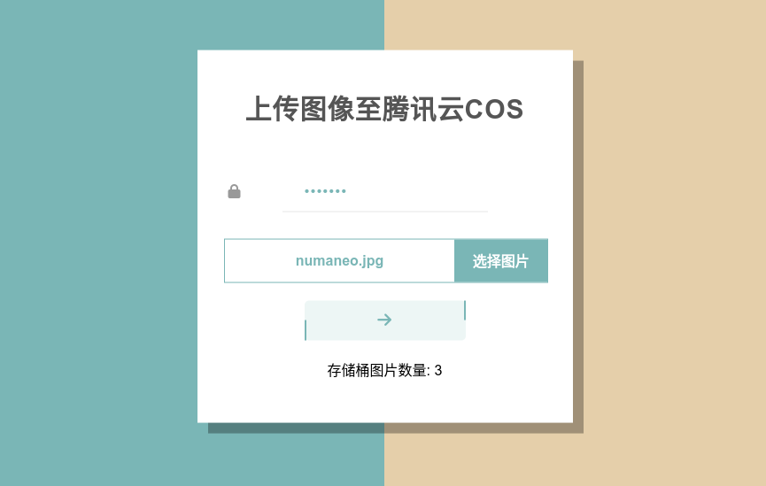
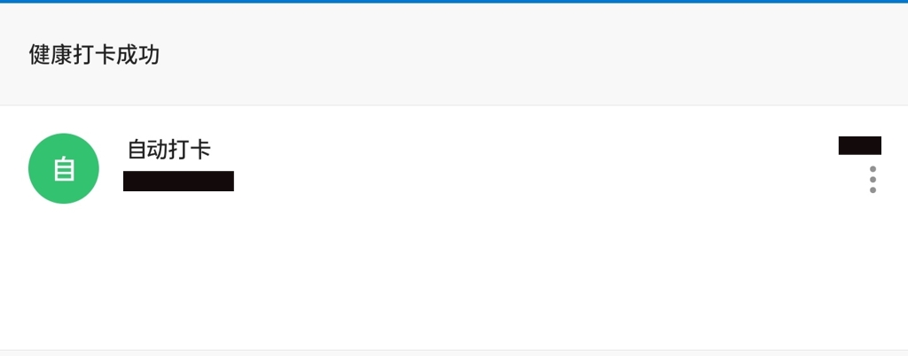
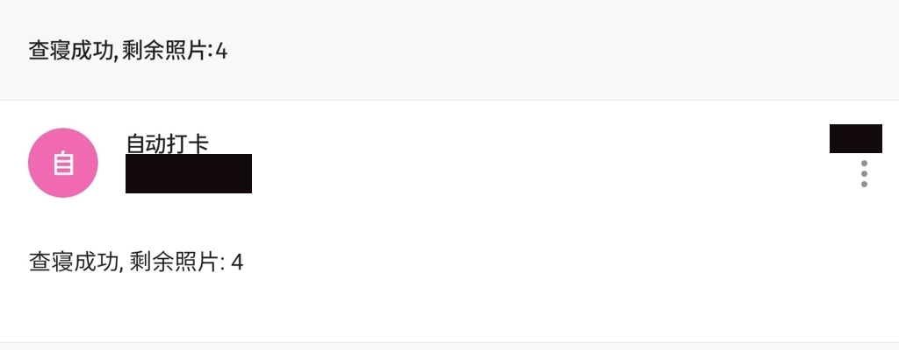
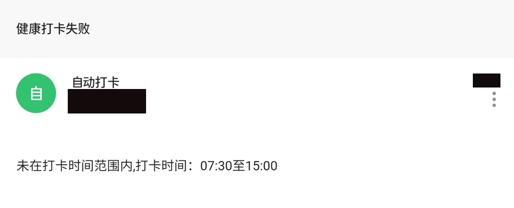
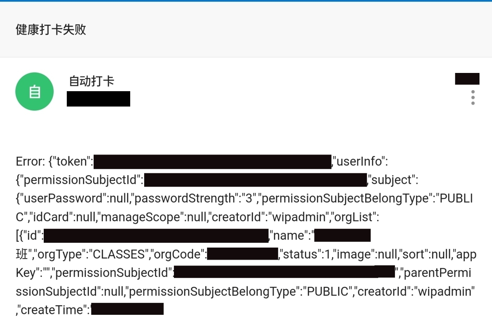

### 部署到腾讯云云函数

> ~~由于字节跳动轻服务注册功能维护, 目前可采用腾讯云云函数暂时代替执行.**但我个人仍然建议轻服务恢复后使用先于时代的[轻服务](https://qingfuwu.cn/)😎**~~
> update 2022.04.14: 轻服务将于2022年6月14日正式停服, 请尽量将项目迁移至本地或腾讯云云函数

使用云函数实现, 您甚至可以不在本地安装Node环境

#### 下载与安装

- 克隆项目 或 单击绿色`Code`按钮, 选择`Download ZIP`
- 进入项目文件夹中`src`目录(无需安装依赖)

#### 将代码部署到腾讯云云函数

1. 打开`config.js`
   1. 替换第2行`local`为`tencent`
   2. 在5, 6行输入用户名密码
   3. [可选]按提示修改定位信息
   4. [可选]如需邮件服务, 修改79行为`enable: true,`, 并按提示修改81-85行
   5. [可选]如需采用腾讯云COS对象存储预上传打卡图片, 请按照[使用COS对象存储实现图片预上传](#使用cos对象存储实现图片预上传)修改配置文件
2. [可选]默认在16:30点后调用函数会执行查寝, 16:30点前调用为健康打卡, 如需修改, 请修改`src/tencent/app.js`第一行
3. 复制`src/tencent/app.js`到`src/app.js`
4. 将`src`目录下的文件压缩为`src.zip`(注意, 压缩包打开后应为若干JS文件而不是src文件夹)
5. 访问[https://serverless.cloud.tencent.com/start?c=scf](https://serverless.cloud.tencent.com/start?c=scf) , 注册帐号并点击前往控制台
6. 点击左侧函数服务, 点击新建, 点击从头开始, 起一个函数名称, 就近选择地域, 运行环境选择`Node.js 16.13`(或更高)
7. 输入执行方法: `app.main_handler`
8. 提交方法选择: `本地上传zip包`, 上传`src.zip`
9. 展开高级配置, 内存: `512MB`, 初始化超时时间: `300`, 执行超时时间: `900`, 启用固定出口IP与DNS缓存
10. 选择完成
11. 选择函数管理-函数代码-找到IDE下的上传方式, 选择在线安装依赖, 点击部署, 等待加载完成(很慢), 点击测试进行测试

#### 使用COS对象存储实现图片预上传

**注意: COS服务为付费服务(虽然在实际使用中扣费极低)**

1. 修改`src/config.js`47行为`tencentCOS`
2. 进入[COS服务](https://console.cloud.tencent.com/cos), 点击左侧存储桶列表, 创建存储桶
3. 就近选择所属地域, 随便起一个名字, 选择私有读写, 其余默认
4. 进入存储桶后找到: 概览-基本信息, 按照提示修改`src/config.js`的73, 74行
5. 登录[https://console.cloud.tencent.com/cam/capi](https://console.cloud.tencent.com/cam/capi), 生成Id并修改`src/config.js`的71, 72行
6. 将同样的参数填入`src/tencent/page/index.html`的16-18行(14行留空, 15行暂时不填)
7. 为了保护登录口令不被泄漏, 请您构造一个图片上传密码. 找一个AES加密工具(例如[此站](https://www.sojson.com/encrypt_aes.html)), 将`secretKey`作为明文, 图片上传密码作为密钥, 生成密文并填入`secretKeyE`.
8. 在存储桶界面左侧找到文件列表-'上传文件', 上传`src/tencent/page/index.html`, 上传成功选择`index.html`右侧-更多-修改访问权限-公有读私有写-确定
9. 在存储桶界面左侧找到文件列表-'创建文件夹'-文件夹名`img`-确定
10. 在存储桶界面左侧找到'安全管理'-'跨域访问CORS设置'-'添加规则'-来源Origin填入`*`-操作Methods全选-保存
11. 在存储桶界面左侧找到'基础配置'-'静态网站'-编辑-当前状态: 开-保存, 点击访问'访问节点即可'
12. 打开页面后, 先输入图片上传密码, 输入完成后网页会自动获取存储桶中剩余图片, 选择图片, 上传即可上传图片. 如下图
   

#### 使用腾讯云云函数实现定时打卡

选择触发管理, 创建触发器, 触发周期选择自定义触发周期, 输入`CRON`表达式

打卡成功/失败会收到如下邮件

- 打卡成功
 
- 查寝成功
 
- 数智X大返回打卡失败
 
- 请求打卡失败
 

> 如果您认为这个项目对您有帮助, 欢迎在右上角给我一个🌟
